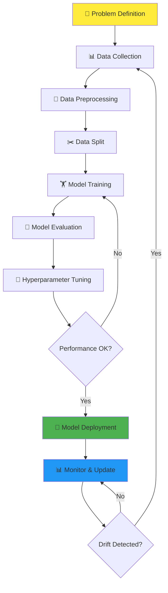

# 🤖 AI & Machine Learning Cheatsheet Summary

*Your comprehensive guide to understanding and applying machine learning concepts*

## 📋 Table of Contents

1. [🎯 What is Machine Learning?](#-what-is-machine-learning)
2. [🔍 AI vs Machine Learning](#-ai-vs-machine-learning)
3. [⚙️ Machine Learning Workflow](#️-machine-learning-workflow)
4. [📊 Types of Machine Learning](#-types-of-machine-learning)
5. [🎓 Supervised Learning](#-supervised-learning)
   - [Classification Models](#classification-models-categorical-target)
   - [Regression Models](#regression-models-continuous-target)
6. [📈 Regression vs Classification Summary](#-regression-vs-classification-summary)
7. [🔍 Unsupervised Learning](#-unsupervised-learning)
8. [🎮 Reinforcement Learning Methods](#-reinforcement-learning-methods)
9. [🛠️ Data Preprocessing](#️-data-preprocessing)
10. [🧠 Deep Learning Fundamentals](#-deep-learning-fundamentals)
11. [⚖️ Bias-Variance Trade-off](#️-bias-variance-trade-off)
12. [⚠️ Common Pitfalls](#️-common-pitfalls)
13. [📚 Additional Resources](#-additional-resources)

---

## 🎯 What is Machine Learning?

**Machine Learning (ML)** is a subset of **Artificial Intelligence (AI)** that enables systems to automatically learn from data and improve performance over time without being explicitly programmed. ML models identify patterns in data to make predictions or decisions.

> **💡 Real-world Example:** Netflix uses ML to analyze your viewing history, preferences, and behavior to recommend movies and shows you're likely to enjoy. The more you watch, the better its recommendations become!

<strong>🔍 Key ML Characteristics (Click to expand)</strong>

- **Data-Driven**: Learns from examples rather than explicit rules
- **Pattern Recognition**: Identifies hidden relationships in data  
- **Predictive Power**: Makes informed predictions on new, unseen data
- **Adaptive**: Improves performance as more data becomes available
- **Automated**: Reduces need for manual programming of rules

---

## 🔍 AI vs Machine Learning

* **🧠 Artificial Intelligence (AI):** A broad field aiming to create machines capable of mimicking human intelligence, including reasoning, learning, and problem-solving.
* **🤖 Machine Learning (ML):** A subset of AI focused on developing algorithms that allow systems to learn patterns from data.

> **💡 Think of it this way:** AI is the destination (intelligent machines), while ML is one of the vehicles to get there (learning from data).

| Aspect | AI | ML |
|--------|----|----|
| **Scope** | Broader field | Subset of AI |
| **Goal** | Mimic human intelligence | Learn from data |
| **Examples** | Chatbots, robots, expert systems | Recommendation engines, fraud detection |
| **Approach** | Multiple techniques | Data-driven algorithms |

---

## ⚙️ Machine Learning Workflow

The ML workflow is a systematic approach to building effective machine learning solutions:

### 📋 Detailed Workflow Steps:

* **🎯 Problem Definition:** Define the objective and success criteria¹
* **📊 Data Collection:** Gather relevant datasets from various sources
* **🧹 Data Preprocessing:** Clean, encode, and scale features²
* **✂️ Data Split:** Divide data into training, validation, and testing sets
* **🏋️ Model Training:** Fit models on training data using algorithms
* **📏 Model Evaluation:** Measure performance using appropriate metrics³
* **🔧 Hyperparameter Tuning:** Optimize model parameters for better performance
* **🚀 Model Deployment:** Integrate the model into production environment
* **📊 Monitor & Update:** Track performance and retrain when needed

> **💡 Pro Tip:** The workflow is iterative! Don't expect to get perfect results on the first try. Each iteration teaches you something new about your data and problem.

> **⚠️ Common Mistake:** Skipping the problem definition step. Always start with a clear understanding of what you're trying to achieve and how you'll measure success!

---

## 📊 Types of Machine Learning

Understanding the three main types of ML helps you choose the right approach for your problem:

| Type | 🎯 What it Does | 📋 Data Requirement | 💼 Example Use Cases | ✅ Benefits | ❌ Limitations |
| ---- | -------------- | ------------------- | ------------------- | ---------- | ------------- |
| **🎓 Supervised Learning** | Learns mapping from input to output using labeled data | Requires labeled data (features + target⁴) | 🏠 House price prediction 📧 Spam detection 🩺 Medical diagnosis | High accuracy with sufficient labeled data; easy evaluation | Requires large labeled datasets; may overfit |
| **🔍 Unsupervised Learning** | Finds hidden patterns without labeled outcomes | Only input features, no target labels | 👥 Customer segmentation 🚨 Anomaly detection 📰 Topic modeling | Explores unknown data; reveals hidden structures | Hard to interpret; no accuracy guarantee |
| **🎮 Reinforcement Learning** | Learns through environment interaction and rewards/penalties | Requires environment with feedback system | 🚗 Self-driving cars 🎯 Game-playing AI 🤖 Robotics control | Learns complex sequential tasks; adapts through experience | Computationally expensive; slow convergence |

> **💡 Quick Decision Guide:**
> - Have labeled data? → **Supervised Learning**
> - Want to find patterns in unlabeled data? → **Unsupervised Learning**  
> - Need to learn through trial and error? → **Reinforcement Learning**

---

## 🎓 Supervised Learning

**Supervised learning** trains models on labeled data to learn the mapping from input (features) to output (labels/values). Think of it as learning with a teacher who provides the "correct answers."

> **💡 Real-world Example:** Teaching a child to recognize animals by showing them pictures labeled "cat," "dog," "bird." After seeing many examples, they can identify animals in new photos.

### 🏷️ Classification Models (Categorical target⁵)

*When you need to predict **categories** or **classes***

| Model               | Explanation                                   | Example Usage                    |
| ------------------- | --------------------------------------------- | -------------------------------- |
| Logistic Regression | Models probability of binary outcomes         | Email spam detection             |
| Decision Trees      | Classifies using feature-based rules          | Loan approval                    |
| Random Forests      | Ensemble of decision trees                    | Diagnosing diseases              |
| SVM                 | Finds best separating hyperplane              | Handwritten digit classification |
| k-NN                | Assigns label based on nearest neighbors      | Product recommendation           |
| Naïve Bayes         | Probabilistic classifier using Bayes’ theorem | Sentiment analysis               |
| Gradient Boosting   | Sequential boosted trees for high accuracy    | Fraud detection                  |
| Neural Networks     | Layers of neurons for complex patterns        | Face recognition                 |

<strong>📊 Classification Evaluation Metrics (Click to expand)</strong>

* **🎯 Accuracy:** Correct predictions / Total → Fraction correct; **misleading for imbalanced data**
* **🔍 Precision:** TP⁶ / (TP+FP⁷) → Of predicted positives, how many are truly positive
* **📈 Recall (Sensitivity):** TP / (TP+FN⁸) → Of actual positives, how many were identified  
* **⚖️ F1-Score:** Harmonic mean of precision & recall → **Balances both metrics**
* **📊 ROC-AUC:** Area under ROC curve → **AUC closer to 1 = better discrimination**
* **🔳 Confusion Matrix:** Visual table of TP, TN⁹, FP, FN → **See exactly where errors occur**

**💡 Metric Selection Guide:**
- **Accuracy**: When classes are balanced
- **Precision**: When false positives are costly (e.g., spam detection)
- **Recall**: When false negatives are costly (e.g., disease detection)
- **F1-Score**: When you need balance between precision and recall

### 📊 Regression Models (Continuous target¹⁰)

*When you need to predict **numerical values***

> **💡 Real-world Example:** Predicting house prices based on features like size, location, age, and amenities. Unlike classification which gives categories, regression provides exact numerical predictions.

| Model | 🔍 Explanation | 🎯 Example Usage | 💡 When to Use |
| ----- | ------------- | --------------- | -------------- |
| **Linear Regression** | Fits straight line relationship between features and target | 🏠 House price prediction | Simple linear relationships; interpretable |
| **Polynomial Regression** | Captures curved relationships with polynomial features | 📈 Population growth modeling | Non-linear but smooth patterns |
| **Ridge & Lasso Regression** | Regularized linear models preventing overfitting | 📊 Stock price prediction | Many features; need feature selection |
| **Decision Tree Regression** | Creates rules based on feature value splits | 🚗 Car value prediction | Non-linear patterns; interpretable rules |
| **Random Forest Regression** | Ensemble of trees for robust predictions | 💰 Sales revenue forecasting | High accuracy; handles overfitting |
| **Support Vector Regression (SVR)** | Finds best-fit boundary with error tolerance | 🌡️ Temperature prediction | Complex patterns; robust to outliers |
| **Gradient Boosting** | Sequential models correcting previous errors | ⚡ Electricity demand forecasting | Maximum accuracy needed |

<strong>📏 Regression Evaluation Metrics (Click to expand)</strong>

* **📏 MAE¹¹:** Average absolute differences → **How far predictions are from actual values**
* **🎯 MSE¹²:** Average squared differences → **Penalizes large errors; sensitive to outliers**
* **📐 RMSE¹³:** Square root of MSE → **Same unit as target; easily interpretable**
* **🎖️ R² Score:** Proportion of variance explained → **0 = no fit, 1 = perfect fit**
* **🔧 Adjusted R²:** R² adjusted for number of predictors → **Useful for multiple regression**

**💡 Metric Selection Guide:**
- **MAE**: When all errors are equally important
- **RMSE**: When large errors are more problematic than small ones
- **R²**: To understand model's explanatory power
- **Adjusted R²**: When comparing models with different numbers of features

---

## 📈 Regression vs Classification Summary

Quick reference to help you choose between regression and classification:

| Aspect | 📊 Regression | 🏷️ Classification |
| ------ | ------------ | ---------------- |
| **🎯 Target Variable** | Continuous numbers | Discrete categories |
| **🎨 Goal** | Predict exact numeric values | Assign to predefined categories |
| **💼 Example Problems** | 🏠 House prices, 📈 Stock prices, 🌡️ Temperature | 📧 Spam detection, 🩺 Disease diagnosis, 👤 Image recognition |
| **⚙️ Algorithms** | Linear, Polynomial, Ridge/Lasso, Trees, RF, SVR, Boosting | Logistic, Trees, Random Forests, SVM, k-NN, Naïve Bayes, Neural Networks |
| **📏 Evaluation Metrics** | MAE, MSE, RMSE, R² | Accuracy, Precision, Recall, F1, ROC-AUC |
| **🎁 Output** | Real number (e.g., $250,000) | Class label (e.g., "Spam") or probability |
| **🏢 Use Cases** | Finance, real estate, forecasting | Healthcare, fraud detection, image/speech recognition |
| **⚠️ Main Challenges** | Sensitive to outliers; assumes numeric relationships | Class imbalance, overfitting, interpretability |

> **💡 Quick Decision:** Ask yourself "What am I predicting?" If it's a number → Regression. If it's a category → Classification.

---

## 🔍 Unsupervised Learning

**Unsupervised learning** finds hidden patterns in data without labeled examples. Think of it as exploring data to discover insights you didn't know existed.

> **💡 Real-world Example:** A streaming service analyzing viewing patterns to discover that people who watch sci-fi also tend to watch documentaries, even though no one told it to look for this connection.

### 🎯 Clustering
*Finding groups of similar data points*

<strong>🔍 Clustering Algorithms (Click to expand)</strong>

* **🎯 k-Means:** Groups data into k clusters using centroids → 👥 Customer segmentation for marketing
* **🌳 Hierarchical Clustering:** Creates nested clusters in tree structure → 📄 Document grouping by topic
* **🔍 DBSCAN:** Finds clusters based on data density → 🚨 Anomaly detection in network traffic
* **🎲 GMM¹⁴:** Probabilistic soft assignment to clusters → 🖼️ Image segmentation
* **📍 Mean Shift:** Automatically discovers number of clusters → 🗺️ Geographical hotspot detection

**💡 Clustering Tips:**
- Start with k-Means for simplicity
- Use DBSCAN when you don't know the number of clusters
- Try Hierarchical for interpretable cluster relationships

### 📐 Dimensionality Reduction
*Simplifying data while keeping important information*

<strong>📐 Dimensionality Reduction Techniques (Click to expand)</strong>

* **📊 PCA¹⁵:** Reduces dimensions while retaining maximum variance → 🖼️ Image compression and noise reduction
* **🔢 SVD¹⁶:** Factorizes matrices into simpler components → 🎬 Recommendation systems (Netflix, Amazon)
* **🎨 t-SNE¹⁷:** Visualizes high-dimensional data in 2D/3D → 📝 Word embeddings visualization
* **🧠 Autoencoders:** Neural networks that compress and reconstruct → 🔊 Noise reduction, 🖼️ image denoising

**💡 When to Use:**
- **PCA**: When you need linear dimensionality reduction and interpretability
- **t-SNE**: For visualization and exploratory data analysis
- **Autoencoders**: For non-linear reduction and when working with images/complex data

---

## 🎮 Reinforcement Learning Methods

**Reinforcement Learning (RL)** teaches agents to make decisions through trial and error, learning from rewards and penalties.

> **💡 Real-world Example:** Teaching a robot to walk by rewarding it for forward movement and penalizing it for falling. Over time, it learns optimal walking strategies.

<strong>🎮 RL Algorithms & Applications (Click to expand)</strong>

* **🗺️ Q-Learning:** Learns optimal actions using Q-table → 🤖 Robot maze navigation
* **🧠 Deep Q-Networks (DQN):** Combines Q-learning with deep learning → 🎮 Playing Atari games
* **🚶 SARSA¹⁸:** Learns from actual actions taken → 🚗 Safe autonomous driving policies
* **🎯 Policy Gradient:** Directly optimizes decision policies → 🦾 Robotic arm control
* **🎭 Actor-Critic:** Combines value and policy learning → 🕹️ Continuous control tasks
* **🛡️ PPO & TRPO:** Stable policy optimization → 🦾 Humanoid robot locomotion
* **🎲 Monte Carlo:** Learns from complete episode experiences → ♟️ Game strategy simulations

**💡 RL Key Concepts:**
- **Agent**: The decision maker (robot, game player)
- **Environment**: The world the agent interacts with
- **Reward**: Feedback signal for actions (+1 for good, -1 for bad)
- **Policy**: Strategy for choosing actions

---

## 🛠️ Data Preprocessing

**Data preprocessing** is crucial for ML success - garbage in, garbage out! Clean, well-prepared data often matters more than the algorithm choice.

> **💡 Real-world Insight:** Data scientists spend 80% of their time on data cleaning and preprocessing, only 20% on actual modeling!

<strong>🧹 Essential Preprocessing Steps (Click to expand)</strong>

### 🚫 Handle Missing Values
* **Remove**: Drop rows/columns with missing data → When data is abundant
* **Fill**: Replace with mean/median/mode → For numerical features
* **Interpolate**: Estimate based on neighboring values → For time series data

### 🏷️ Encode Categorical Data
* **🔢 LabelEncoder**: Convert categories to numbers (0,1,2...) → For ordinal data
* **🎯 OneHotEncoder**: Create binary columns for each category → For nominal data
* **📊 OrdinalEncoder**: Preserve order in categories → For ranked data (small, medium, large)

### ⚖️ Feature Scaling
* **📏 StandardScaler**: Mean=0, std=1 (Z-score normalization) → For algorithms sensitive to scale
* **📐 MinMaxScaler**: Scale to range [0,1] → When you need bounded values
* **🛡️ RobustScaler**: Uses median and IQR → When data has outliers

**⚠️ Preprocessing Gotchas:**
- **Never** fit scalers on test data - leads to data leakage!
- Handle missing values **before** splitting data
- Be careful with time series - don't use future data to predict past!

---

## 🧠 Deep Learning Fundamentals

**Deep Learning** uses neural networks with multiple layers to learn complex patterns. Think of it as inspired by how the human brain processes information.

> **💡 Real-world Example:** Your smartphone camera recognizing faces uses Convolutional Neural Networks (CNNs) to understand visual patterns like edges, shapes, and eventually complete faces.

<strong>🧠 Neural Network Types & Applications (Click to expand)</strong>

* **🌐 ANN¹⁹ (Artificial Neural Networks):** General-purpose networks → 🏠 Housing price prediction, 📊 tabular data analysis
* **👁️ CNN²⁰ (Convolutional Networks):** Specialized for images with convolution layers → 📷 Object detection, 🩺 medical imaging, 🚗 self-driving cars
* **🔄 RNN²¹ (Recurrent Networks):** Handle sequential data with memory → 📝 Next word prediction, 🎵 music generation, 📈 time series forecasting
* **🤖 Transformers (BERT, GPT):** Attention-based architecture → 🈺 Machine translation, 💬 ChatGPT, 📰 text summarization

**💡 Deep Learning Guidelines:**
- **CNN**: Use for images, spatial data
- **RNN/LSTM**: Use for sequences, time series
- **Transformers**: Use for language, complex sequences
- **ANN**: Use for structured/tabular data

**⚠️ Deep Learning Requirements:**
- Large datasets (thousands to millions of examples)
- Significant computational resources (GPUs recommended)
- Longer training times compared to traditional ML

---

## ⚖️ Bias-Variance Trade-off

Understanding this fundamental concept helps you build better models and avoid common ML pitfalls.

> **💡 Think of it like archery:** Bias is consistently missing the target in the same direction (systematic error). Variance is shots scattered around (random error). Good models have both low bias AND low variance.

<strong>⚖️ Bias-Variance Breakdown (Click to expand)</strong>

* **🎯 Bias:** Error from overly simple models that miss important patterns (**underfitting**)
  - *Example:* Using linear regression for clearly non-linear data
  - *Solutions:* Use more complex models, add polynomial features

* **📊 Variance:** Error from overly complex models that learn noise (**overfitting**)
  - *Example:* Decision tree that memorizes training data perfectly
  - *Solutions:* Use regularization, get more data, ensemble methods

* **🎖️ Goal:** Find the sweet spot that **balances both for optimal generalization**

**💡 Practical Tips:**
- **High Bias**: Try more complex models, add features
- **High Variance**: Add regularization, get more data, use ensemble methods
- **Both**: Start simple, then gradually increase complexity

---

## ⚠️ Common Pitfalls

Avoid these expensive mistakes that even experienced practitioners make!

> **💡 Prevention Insight:** Most ML failures come from data issues, not algorithm choice. Focus on data quality first!

### 🚨 Critical Mistakes to Avoid:

<strong>⚠️ Data Leakage (Click to expand)</strong>

**What it is:** When information from the future or target variable accidentally influences training.

**Examples:**
- Using tomorrow's stock price to predict today's price
- Including the target variable as a feature (directly or indirectly)
- Scaling using statistics from the entire dataset before splitting

**🛡️ Prevention:**
- Always split data BEFORE any preprocessing
- Be suspicious of "too good to be true" results
- Carefully examine feature correlations with target

<strong>⚖️ Imbalanced Data (Click to expand)</strong>

**What it is:** When some classes have much fewer examples than others.

**Example:** Fraud detection where 99.9% of transactions are legitimate.

**🛡️ Solutions:**
- Use appropriate metrics (Precision, Recall, F1 instead of just Accuracy)
- Apply sampling techniques (SMOTE, undersampling, oversampling)
- Use class weights in algorithms
- Consider ensemble methods

<strong>🎯 Overfitting / Underfitting (Click to expand)</strong>

**Overfitting:** Model learns training data too well, fails on new data.
- *Signs:* Perfect training accuracy, poor test performance
- *Solutions:* More data, regularization, simpler models, cross-validation

**Underfitting:** Model too simple to capture underlying patterns.
- *Signs:* Poor performance on both training and test data
- *Solutions:* More complex models, additional features, reduce regularization

**💡 Golden Rule:** Always validate on data the model has never seen!

---

## 📚 Additional Resources

### 🎓 Learning Platforms
- **[Coursera ML Course](https://www.coursera.org/learn/machine-learning)** - Andrew Ng's famous introduction to ML
- **[Fast.ai](https://www.fast.ai/)** - Practical deep learning for coders
- **[Kaggle Learn](https://www.kaggle.com/learn)** - Free micro-courses with hands-on practice

### 📖 Essential Books
- **[Hands-On ML](https://www.oreilly.com/library/view/hands-on-machine-learning/9781492032632/)** - Practical guide with Scikit-learn and TensorFlow
- **[Pattern Recognition and ML](https://www.microsoft.com/en-us/research/publication/pattern-recognition-machine-learning/)** - Mathematical foundations

### 🛠️ Tools & Libraries
- **[Scikit-learn](https://scikit-learn.org/)** - Python's go-to ML library
- **[TensorFlow](https://www.tensorflow.org/)/[PyTorch](https://pytorch.org/)** - Deep learning frameworks
- **[Jupyter Notebooks](https://jupyter.org/)** - Interactive development environment

### 🏆 Practice Platforms
- **[Kaggle](https://www.kaggle.com/)** - Competitions and datasets
- **[Google Colab](https://colab.research.google.com/)** - Free GPU/TPU for experiments

---

## 📝 Footnotes

¹ **Problem Definition**: Clearly state what you want to predict and how you'll measure success  
² **Data Preprocessing**: Clean and prepare raw data for ML algorithms  
³ **Performance Metrics**: Quantitative measures to evaluate model quality  
⁴ **Target Variable**: The outcome you want to predict (also called label or dependent variable)  
⁵ **Categorical Target**: Discrete categories like "spam/not spam" or "cat/dog/bird"  
⁶ **TP (True Positive)**: Correctly predicted positive cases  
⁷ **FP (False Positive)**: Incorrectly predicted positive cases (Type I error)  
⁸ **FN (False Negative)**: Incorrectly predicted negative cases (Type II error)  
⁹ **TN (True Negative)**: Correctly predicted negative cases  
¹⁰ **Continuous Target**: Numerical values like prices, temperatures, or distances  
¹¹ **MAE (Mean Absolute Error)**: Average of absolute differences between predicted and actual values  
¹² **MSE (Mean Squared Error)**: Average of squared differences between predicted and actual values  
¹³ **RMSE (Root Mean Square Error)**: Square root of MSE, same units as target variable  
¹⁴ **GMM (Gaussian Mixture Model)**: Probabilistic clustering using Gaussian distributions  
¹⁵ **PCA (Principal Component Analysis)**: Linear dimensionality reduction technique  
¹⁶ **SVD (Singular Value Decomposition)**: Matrix factorization technique  
¹⁷ **t-SNE (t-Distributed Stochastic Neighbor Embedding)**: Non-linear dimensionality reduction for visualization  
¹⁸ **SARSA (State-Action-Reward-State-Action)**: On-policy reinforcement learning algorithm  
¹⁹ **ANN (Artificial Neural Network)**: Basic neural network with fully connected layers  
²⁰ **CNN (Convolutional Neural Network)**: Neural network designed for processing grid-like data (images)  
²¹ **RNN (Recurrent Neural Network)**: Neural network designed for sequential data with memory
