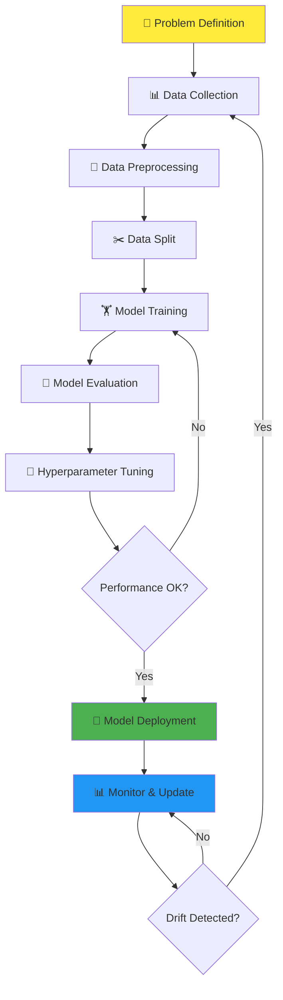

# 🤖 AI & Machine Learning Cheatsheet Summary

*Your comprehensive guide to understanding and applying machine learning concepts*

## 📋 Table of Contents

1. [🎯 What is Machine Learning?](#-what-is-machine-learning)
2. [🔍 AI vs Machine Learning](#-ai-vs-machine-learning)
3. [⚙️ Machine Learning Workflow](#️-machine-learning-workflow)
4. [📊 Types of Machine Learning](#-types-of-machine-learning)
5. [🎓 Supervised Learning](#-supervised-learning)
   - [Classification Models](#classification-models-categorical-target)
   - [Regression Models](#regression-models-continuous-target)
6. [📈 Regression vs Classification Summary](#-regression-vs-classification-summary)
7. [🔍 Unsupervised Learning](#-unsupervised-learning)
8. [🎮 Reinforcement Learning Methods](#-reinforcement-learning-methods)
9. [🛠️ Data Preprocessing](#️-data-preprocessing)
10. [🧠 Deep Learning Fundamentals](#-deep-learning-fundamentals)
11. [⚖️ Bias-Variance Trade-off](#️-bias-variance-trade-off)
12. [⚠️ Common Pitfalls](#️-common-pitfalls)
13. [📚 Additional Resources](#-additional-resources)

---

## 🎯 What is Machine Learning?

**Machine Learning (ML)** is a subset of **Artificial Intelligence (AI)** that enables systems to automatically learn from data and improve performance over time without being explicitly programmed. ML models identify patterns in data to make predictions or decisions.

> **💡 Real-world Example:** Netflix uses ML to analyze your viewing history, preferences, and behavior to recommend movies and shows you're likely to enjoy. The more you watch, the better its recommendations become!

<strong>🔍 Key ML Characteristics (Click to expand)</strong>

- **Data-Driven**: Learns from examples rather than explicit rules
- **Pattern Recognition**: Identifies hidden relationships in data  
- **Predictive Power**: Makes informed predictions on new, unseen data
- **Adaptive**: Improves performance as more data becomes available
- **Automated**: Reduces need for manual programming of rules

---

## 🔍 AI vs Machine Learning

* **🧠 Artificial Intelligence (AI):** A broad field aiming to create machines capable of mimicking human intelligence, including reasoning, learning, and problem-solving.
* **🤖 Machine Learning (ML):** A subset of AI focused on developing algorithms that allow systems to learn patterns from data.

> **💡 Think of it this way:** AI is the destination (intelligent machines), while ML is one of the vehicles to get there (learning from data).

| Aspect | AI | ML |
|--------|----|----|
| **Scope** | Broader field | Subset of AI |
| **Goal** | Mimic human intelligence | Learn from data |
| **Examples** | Chatbots, robots, expert systems | Recommendation engines, fraud detection |
| **Approach** | Multiple techniques | Data-driven algorithms |

---

## ⚙️ Machine Learning Workflow

The ML workflow is a systematic approach to building effective machine learning solutions:

### 📋 Detailed Workflow Steps:

* **🎯 Problem Definition:** Define the objective and success criteria¹
* **📊 Data Collection:** Gather relevant datasets from various sources
* **🧹 Data Preprocessing:** Clean, encode, and scale features²
* **✂️ Data Split:** Divide data into training, validation, and testing sets
* **🏋️ Model Training:** Fit models on training data using algorithms
* **📏 Model Evaluation:** Measure performance using appropriate metrics³
* **🔧 Hyperparameter Tuning:** Optimize model parameters for better performance
* **🚀 Model Deployment:** Integrate the model into production environment
* **📊 Monitor & Update:** Track performance and retrain when needed

> **💡 Pro Tip:** The workflow is iterative! Don't expect to get perfect results on the first try. Each iteration teaches you something new about your data and problem.

> **⚠️ Common Mistake:** Skipping the problem definition step. Always start with a clear understanding of what you're trying to achieve and how you'll measure success!

---

## 📊 Types of Machine Learning

Understanding the three main types of ML helps you choose the right approach for your problem:

| Type | 🎯 What it Does | 📋 Data Requirement | 💼 Example Use Cases | ✅ Benefits | ❌ Limitations |
| ---- | -------------- | ------------------- | ------------------- | ---------- | ------------- |
| **🎓 Supervised Learning** | Learns mapping from input to output using labeled data | Requires labeled data (features + target⁴) | 🏠 House price prediction 📧 Spam detection 🩺 Medical diagnosis | High accuracy with sufficient labeled data; easy evaluation | Requires large labeled datasets; may overfit |
| **🔍 Unsupervised Learning** | Finds hidden patterns without labeled outcomes | Only input features, no target labels | 👥 Customer segmentation 🚨 Anomaly detection 📰 Topic modeling | Explores unknown data; reveals hidden structures | Hard to interpret; no accuracy guarantee |
| **🎮 Reinforcement Learning** | Learns through environment interaction and rewards/penalties | Requires environment with feedback system | 🚗 Self-driving cars 🎯 Game-playing AI 🤖 Robotics control | Learns complex sequential tasks; adapts through experience | Computationally expensive; slow convergence |

> **💡 Quick Decision Guide:**
> - Have labeled data? → **Supervised Learning**
> - Want to find patterns in unlabeled data? → **Unsupervised Learning**  
> - Need to learn through trial and error? → **Reinforcement Learning**

---

## 🎓 Supervised Learning

**Supervised learning** trains models on labeled data to learn the mapping from input (features) to output (labels/values). Think of it as learning with a teacher who provides the "correct answers."

> **💡 Real-world Example:** Teaching a child to recognize animals by showing them pictures labeled "cat," "dog," "bird." After seeing many examples, they can identify animals in new photos.

### 🏷️ Classification Models (Categorical target⁵)

*When you need to predict **categories** or **classes***

| Model               | Explanation                                   | Example Usage                    |
| ------------------- | --------------------------------------------- | -------------------------------- |
| Logistic Regression | Models probability of binary outcomes         | Email spam detection             |
| Decision Trees      | Classifies using feature-based rules          | Loan approval                    |
| Random Forests      | Ensemble of decision trees                    | Diagnosing diseases              |
| SVM                 | Finds best separating hyperplane              | Handwritten digit classification |
| k-NN                | Assigns label based on nearest neighbors      | Product recommendation           |
| Naïve Bayes         | Probabilistic classifier using Bayes’ theorem | Sentiment analysis               |
| Gradient Boosting   | Sequential boosted trees for high accuracy    | Fraud detection                  |
| Neural Networks     | Layers of neurons for complex patterns        | Face recognition                 |

**Evaluation Metrics**

* **Accuracy:** Correct predictions / Total → Fraction of correct predictions; misleading for imbalanced data.
* **Precision:** TP / (TP+FP) → Of predicted positives, how many are truly positive.
* **Recall (Sensitivity):** TP / (TP+FN) → Of actual positives, how many were identified.
* **F1-Score:** Harmonic mean of precision & recall → Balances precision & recall.
* **ROC-AUC:** Tradeoff between TPR and FPR → AUC closer to 1 = better discrimination.
* **Confusion Matrix:** Table of TP, TN, FP, FN → Visual breakdown of results.

### Regression Models (Continuous target)

| Model                           | Explanation                                      | Example Usage                  |
| ------------------------------- | ------------------------------------------------ | ------------------------------ |
| Linear Regression               | Fits a straight line between features and output | House price prediction         |
| Polynomial Regression           | Captures curves with polynomial features         | Population growth modeling     |
| Ridge & Lasso Regression        | Regularized linear models to reduce overfitting  | Stock price prediction         |
| Decision Tree Regression        | Splits data into branches based on conditions    | Car value prediction           |
| Random Forest Regression        | Ensemble of trees for robust predictions         | Sales revenue forecasting      |
| Support Vector Regression (SVR) | Finds best-fit boundary with error tolerance     | Temperature trends prediction  |
| Gradient Boosting               | Sequential models correcting previous errors     | Electricity demand forecasting |

**Regression Metrics**

* **MAE:** Average absolute differences → How far predictions are from actual values.
* **MSE:** Average squared differences → Penalizes large errors; sensitive to outliers.
* **RMSE:** Square root of MSE → Same unit as target; interpretable.
* **R² Score:** Proportion of variance explained → 0 = no fit, 1 = perfect fit.
* **Adjusted R²:** R² adjusted for number of predictors → Useful for multiple regression.

---

## Regression vs Classification Summary

| Aspect             | Regression                                                                             | Classification                                                                    |
| ------------------ | -------------------------------------------------------------------------------------- | --------------------------------------------------------------------------------- |
| Target Variable    | Continuous                                                                             | Categorical                                                                       |
| Goal               | Predict exact numeric values                                                           | Assign input to predefined categories                                             |
| Example Problems   | House price, stock price, temperature                                                  | Spam detection, disease diagnosis, image recognition                              |
| Algorithms         | Linear, Polynomial, Ridge/Lasso, Decision Trees, Random Forest, SVR, Gradient Boosting | Logistic, Decision Trees, Random Forests, SVM, k-NN, Naïve Bayes, Neural Networks |
| Evaluation Metrics | MAE, MSE, RMSE, R²                                                                     | Accuracy, Precision, Recall, F1 Score, ROC-AUC                                    |
| Output             | Real number                                                                            | Class label or probability                                                        |
| Use Cases          | Finance, real estate, forecasting                                                      | Healthcare, fraud detection, image/speech recognition                             |
| Challenges         | Sensitive to outliers; assumes numeric relationships                                   | Class imbalance, overfitting, interpretability                                    |

---

## Unsupervised Learning

### Clustering

* **k-Means:** Groups data into k clusters → Customer segmentation.
* **Hierarchical Clustering:** Nested clusters → Document grouping.
* **DBSCAN:** Density-based clustering → Anomaly detection.
* **GMM:** Probabilistic assignment → Image segmentation.
* **Mean Shift:** Auto-discovers cluster count → Geographical hotspot detection.

### Dimensionality Reduction

* **PCA:** Reduce dimensions retaining variance → Image compression.
* **SVD:** Factorizes matrices → Recommendation systems.
* **t-SNE:** Visualizes high-dimensional data → Word embeddings visualization.
* **Autoencoders:** Compress & reconstruct data → Noise reduction in images.

---

## Reinforcement Learning Methods

* **Q-Learning:** Optimal actions using Q-table → Robot maze navigation.
* **Deep Q-Networks:** Uses deep learning → Playing Atari games.
* **SARSA:** Learns based on actual action → Safe driving policy.
* **Policy Gradient Methods:** Optimize policies directly → Robotic arm control.
* **Actor-Critic:** Combines value & policy-based learning → Continuous control tasks.
* **PPO & TRPO:** Stable training → Humanoid robot control.
* **Monte Carlo:** Learn from averaging episodes → Game simulations.

---

## Data Preprocessing

* Handle missing values: remove, fill, interpolate.
* Encode categorical data: LabelEncoder, OneHotEncoder, OrdinalEncoder.
* Feature scaling: StandardScaler, MinMaxScaler, RobustScaler.

---

## Deep Learning Fundamentals

* **ANN:** General-purpose → Housing prices prediction.
* **CNN:** Convolution layers → Object detection in photos.
* **RNN:** Recurrent layers → Next word prediction.
* **Transformers (BERT, GPT):** Attention-based → Machine translation, chatbots.

---

## Bias-Variance Trade-off

* **Bias:** Error from overly simple models (underfitting).
* **Variance:** Error from overly complex models (overfitting).
* **Goal:** Balance bias and variance for optimal generalization.

---

## Common Pitfalls

* **Data Leakage:** Test data influences training.
* **Imbalanced Data:** Unequal class distribution.
* **Overfitting / Underfitting:** Model too complex/simple for data.
